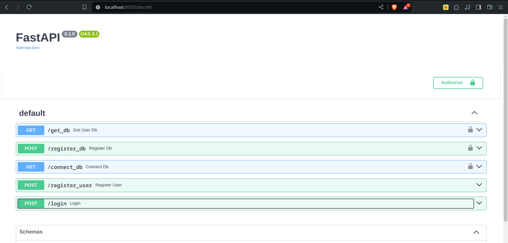

```
University: [ITMO University](https://itmo.ru/ru/)
Faculty: [FICT](https://fict.itmo.ru)
Course: [Application containerization and orchestration](https://github.com/itmo-ict-faculty/application-containerization-and-orchestration)
Year: 2023/2024
Group: K4113c
Author: Karaulov Andrei Olegovich
Practice: practice1
Date of create: 25.04.2024
Date of finished: 25.04.2024
```


## Создать микроcервис на языке программирования Python/Java/любом другом


Ведется разработка API сервиса для системы с обучением моделей. На данный момент реализованы регистрация и логин юзера, а также эндпоинты для подключения базы данных юзера


соответствующем следующим требованиям: 
- Поддержка swagger - автоматически реализуется средствами FastAPI и Pydantic
 
- Может быть контейнеризированно
```yaml
ARG PYTHON_VERSION=3.10

FROM python:${PYTHON_VERSION}-slim AS base

# Prevents Python from writing pyc files
ENV PYTHONDONTWRITEBYTECODE=1

# Keeps Python from buffering stdout and stderr
ENV PYTHONUNBUFFERED=1

WORKDIR /app

COPY requirements.txt .

# Install dependencies
RUN pip install --no-cache-dir -r requirements.txt

# Create a non-privileged user and switch to it
ARG UID=10001
RUN adduser \
    --disabled-password \
    --gecos "" \
    --home "/nonexistent" \
    --shell "/sbin/nologin" \
    --no-create-home \
    --uid "${UID}" \
    appuser

USER appuser

COPY . .

ARG PORT
EXPOSE $PORT

CMD ["python", "main.py"]
```

```yaml
version: "3.8"
services:
  myapp:
    build:
      context: .
      args:
        PYTHON_VERSION: "3.10"
        PORT: ${API_PORT:-8000}
    ports:
      - "${API_PORT:-8000}:${API_PORT:-8000}"
    environment:
      - PORT=${API_PORT:-8000}
    restart: unless-stopped
    depends_on:
      - db

  db:
    image: postgres:16
    ports:
      - "5432:5432"
    environment:
      - POSTGRES_DB=${POSTGRES_DB:-postgres}
      - POSTGRES_USER=${POSTGRES_USER:-admin}
      - POSTGRES_PASSWORD=${POSTGRES_PASSWORD:-admin}
    volumes:
      - postgres_data:/var/lib/postgresql/data
      - ./db/init.sql:/docker-entrypoint-initdb.d/init.sql

volumes:
  postgres_data:

```
- Выполняет 1 полезную функцию (степень полезности определяется самостоятельно)
Логирование и создание юзера
- Имеет функционал хранение/записи данных в любую БД
Юзеры хранятся в бд

Определить зависимости приложения и создать Docker образ с помощью Dockerfile.

Запустить, приложить доказательства работы приложения.
