```
University: [ITMO University](https://itmo.ru/ru/)
Faculty: [FICT](https://fict.itmo.ru)
Course: [Application containerization and orchestration](https://github.com/itmo-ict-faculty/application-containerization-and-orchestration)
Year: 2023/2024
Group: K4113c
Author: Karaulov Andrei Olegovich
Practice: practice3
Date of create: 06.05.2024
Date of finished: 06.05.2024
```
# Инструкция по установке и подключению Jenkins

## Подключение к ВМ с пробросом порта

Необходимо пробросить порт на сервер, т.к. Jenkins имеет UI

```bash
ssh <user>@<address> -p <port> -L 8080:127.0.0.1:8080
```

## Установка на ВМ

1. Установим java

```bash
sudo apt install -y openjdk-17-jre-headless
```

2. Запустим установку следующими командами

```bash
sudo wget -O /usr/share/keyrings/jenkins-keyring.asc \
  https://pkg.jenkins.io/debian-stable/jenkins.io-2023.key
echo "deb [signed-by=/usr/share/keyrings/jenkins-keyring.asc]" \
  https://pkg.jenkins.io/debian-stable binary/ | sudo tee \
  /etc/apt/sources.list.d/jenkins.list > /dev/null
sudo apt-get update
sudo apt-get install jenkins
```

3. Ставим инструмент для сборки docker образов

```bash
apt install buildah
```

4.

```bash
echo jenkins:10000:65536 >> /etc/subuid
echo jenkins:10000:65536 >> /etc/subgid
```

<details><summary>Объяснение команд</summary>
UID (User ID) — это уникальный номер, который присваивается каждому пользователю. GID (Group ID) — это номер, который присваивается каждой группе пользователей.

subuid и subgid — это системы, которые позволяют администраторам задавать "дополнительные" идентификаторы для пользователей и групп. Это нужно для того, чтобы один пользователь мог действовать от имени нескольких пользователей внутри системы. Эти дополнительные идентификаторы используются в основном при работе с контейнерами, такими как Docker.

Когда Jenkins запускает контейнеры (например, для выполнения задач по сборке и тестированию в изолированной среде), он может использовать любой UID и GID из указанного диапазона (10000-75535) внутри этих контейнеров. Это означает, что если процесс внутри контейнера будет скомпрометирован, он не сможет взаимодействовать с основной системой так, как если бы он запущен был под реальным UID/GID Jenkins на хосте.

</details>

## Запуск Jenkins

После успешно выполненных шагов, будет доступен Jenkins UI по адресу http://localhost:8080/
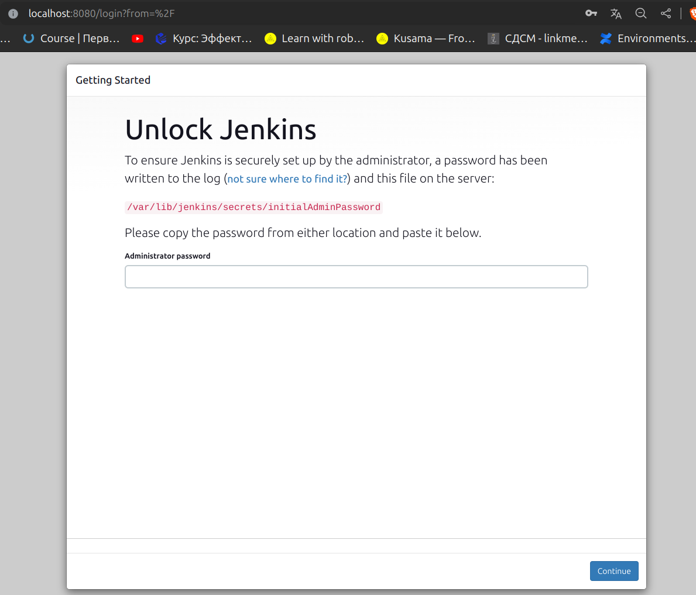

```bash
cat /var/lib/jenkins/secrets/initialAdminPassword
```

Устанавливаем предложенные плагины и после выполнения всех шагов, попадаем на главную страницу.
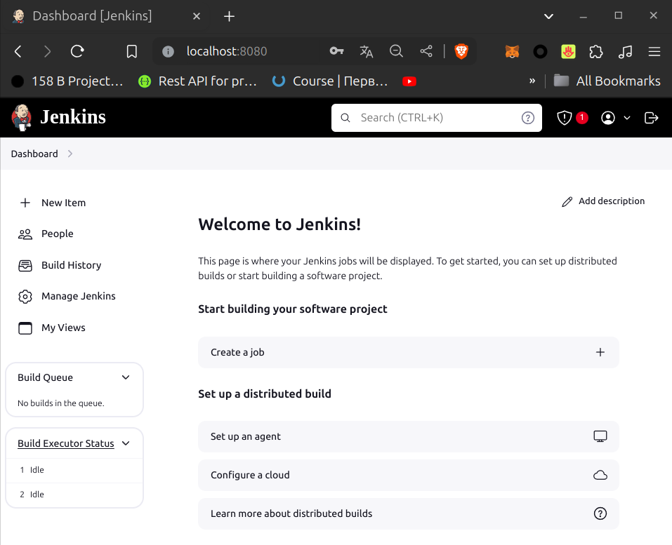

## Gitlab + Jenkins

1. Необходимо создать Access token для репозитория
   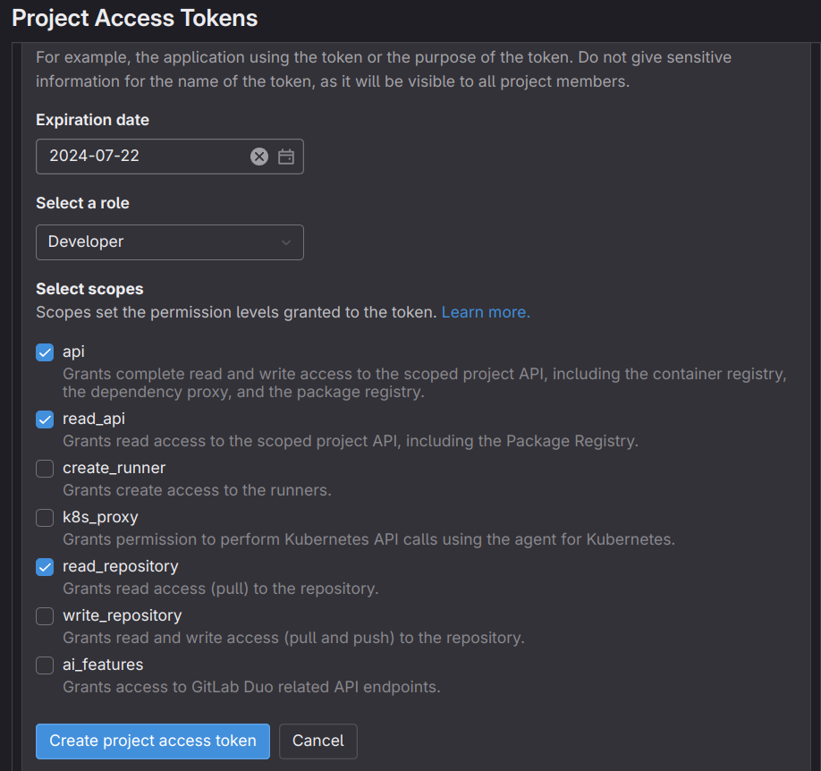
   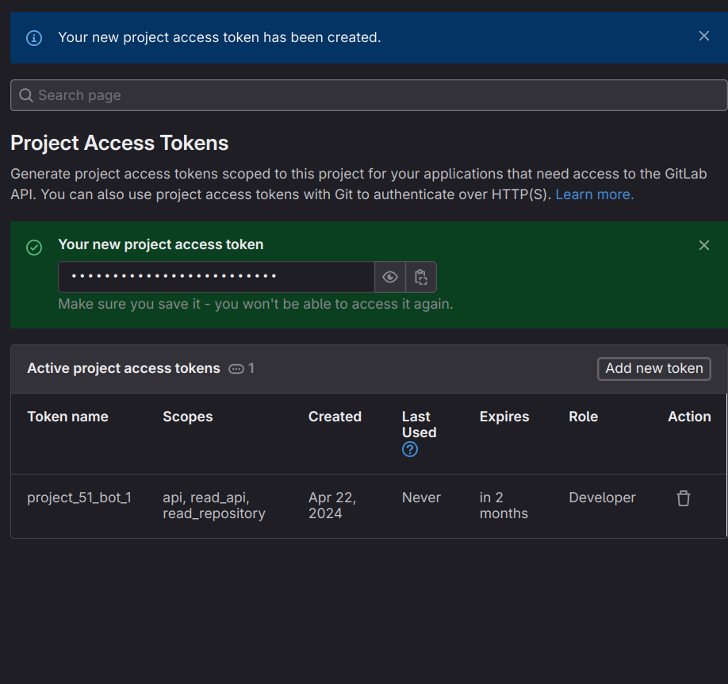
2. Необходимо добавить токен в Jenkins. Переходим в Dashboard-> Manage Jenkins-> Credentials-> System и добавляем токен
   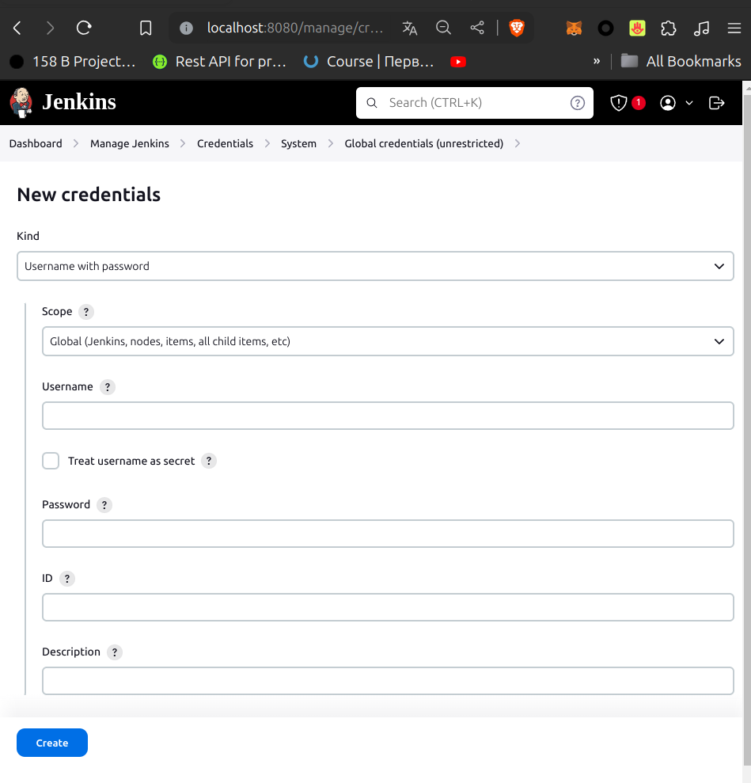

## Первая задача в Jenkins

1. Создадим новую задачу
   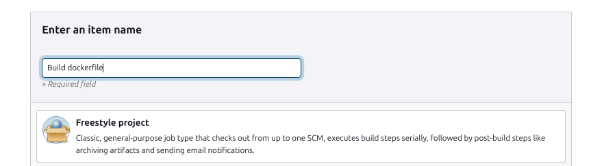
2. Добавим параметры PORT и BRANCH_NAME
   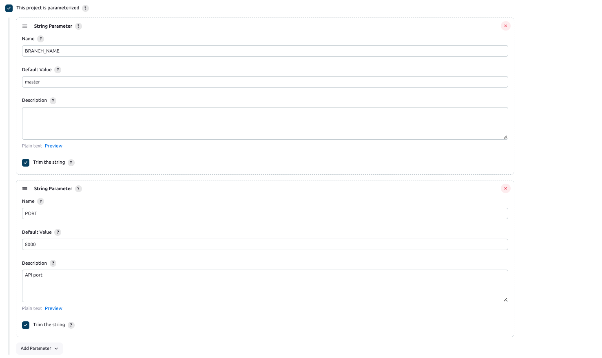
3. Настроим Branch Specifier
   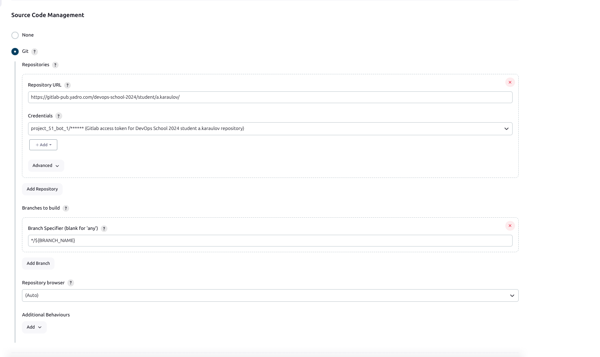
4. Добавим scheduler
   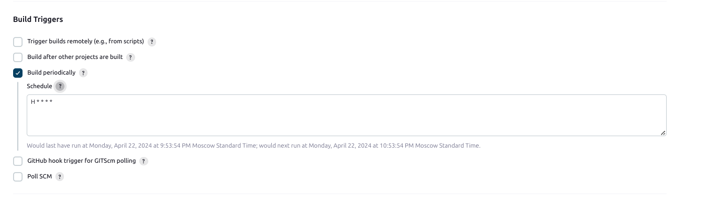
5. Добавим build step
   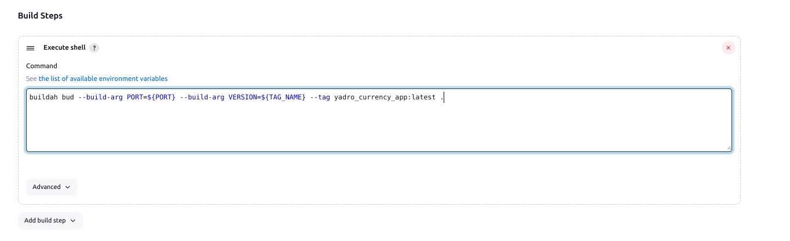
6. Запустим сборку
   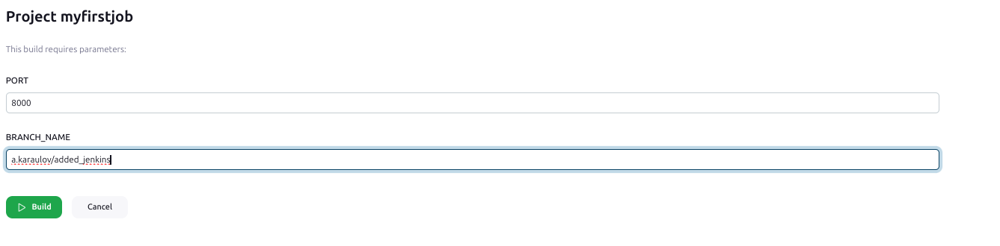
   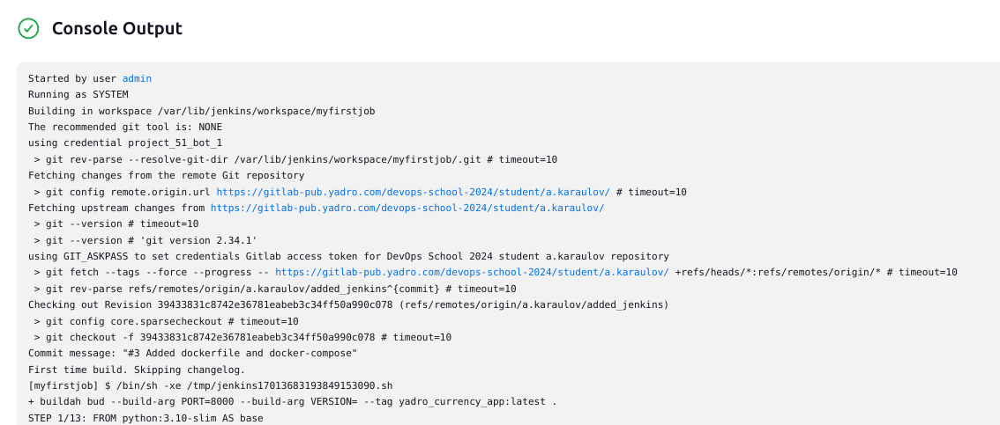
   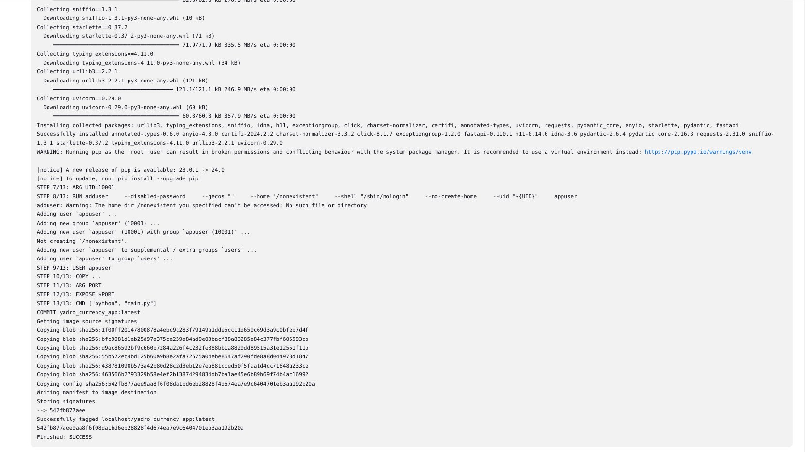


## Напишем свой пайплайн используя Groovy

#### Создадим multibranch pipeline


#### Создадим Jenkinsfile

   ```yaml
      def buildDockerImage(String repo, String tag, String port, String version) {
        return {
          dir(repo) {
            sh "buildah bud \
            --build-arg PORT=${port} \
            --build-arg VERSION=${version} \
            --tag creampanda/yadro_currency_app:${tag} ."
          }
        }
      }

      def updateDockerImage(String repo, String tag, String credentials_id) {
        return {
          dir(repo) {
            withCredentials([usernamePassword(
              credentialsId: credentials_id,
              passwordVariable: 'HUB_PASSWORD',
              usernameVariable: 'HUB_USERNAME'
            )]) {
              sh """
                buildah login -u ${HUB_USERNAME} -p ${HUB_PASSWORD} docker.io
                buildah push creampanda/yadro_currency_app:${tag}
                buildah logout docker.io
              """
            }
          }
        }
      }

      node {
          REPO = 'repo'
          BRANCH_NAME = env.BRANCH_NAME ?: 'master'
          GIT_CREDENTIALS_ID = 'project_51_bot_1'
          DOCKER_CREDENTIALS_ID = 'DockerHubToken'
          GIT_URL = 'https://gitlab-pub.yadro.com/devops-school-2024/student/a.karaulov'
          PORT = '8080'
          TAG_NAME = BRANCH_NAME == 'master' ? 'stable' : 'latest'

          stage('Checkout repo') {
              checkout scmGit(branches: [
              [name: "${BRANCH_NAME}"]
            ],
            extensions: [
              [$class: 'RelativeTargetDirectory', relativeTargetDir: "${REPO}"]
            ],
            userRemoteConfigs: [
              [
                credentialsId: GIT_CREDENTIALS_ID,
                url: GIT_URL
              ]
            ]
          )
          }
          stage('Build docker image') {
              buildDockerImage(REPO, TAG_NAME, PORT, env.TAG_NAME ?: '')()
          }
          stage('Push docker image to docker hub') {
              updateDockerImage(REPO, 'latest', DOCKER_CREDENTIALS_ID)()
              if (BRANCH_NAME == 'master') {
                updateDockerImage(REPO, 'stable', DOCKER_CREDENTIALS_ID)()
              }
          }
      }
   ```

   Мы добавили 3 стейджа - checkout, build и push.

